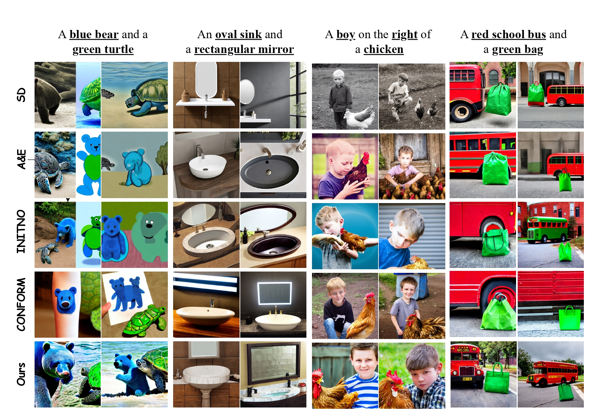

# Fine-Grained Alignment and Noise Refinement for Compositional Text-to-Image Generation

## Introduction

We present the codebase for our project for inference-time optimization and refinement of Text-To-Image generation.

## Installation

Install the project via Conda using the provided ```requirements.yml``` file.
